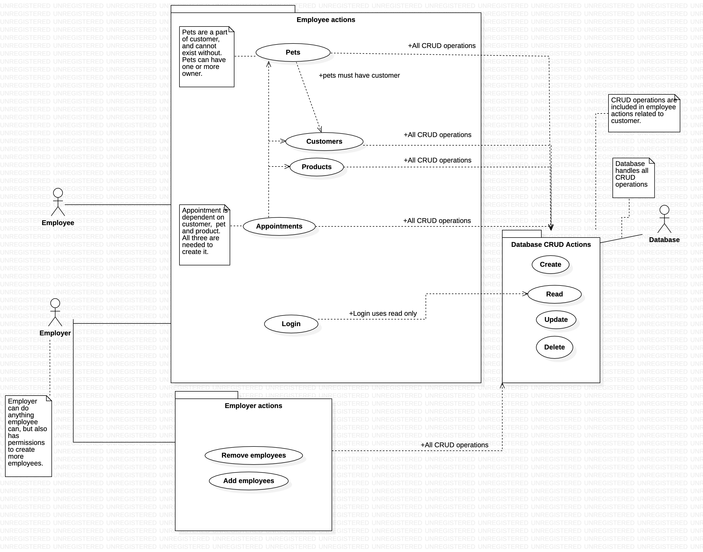
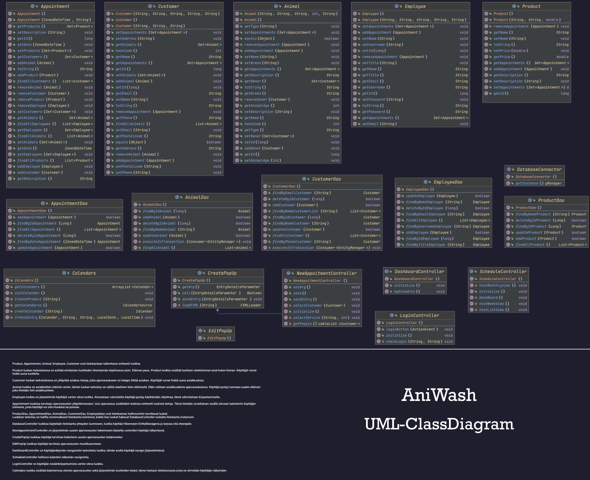
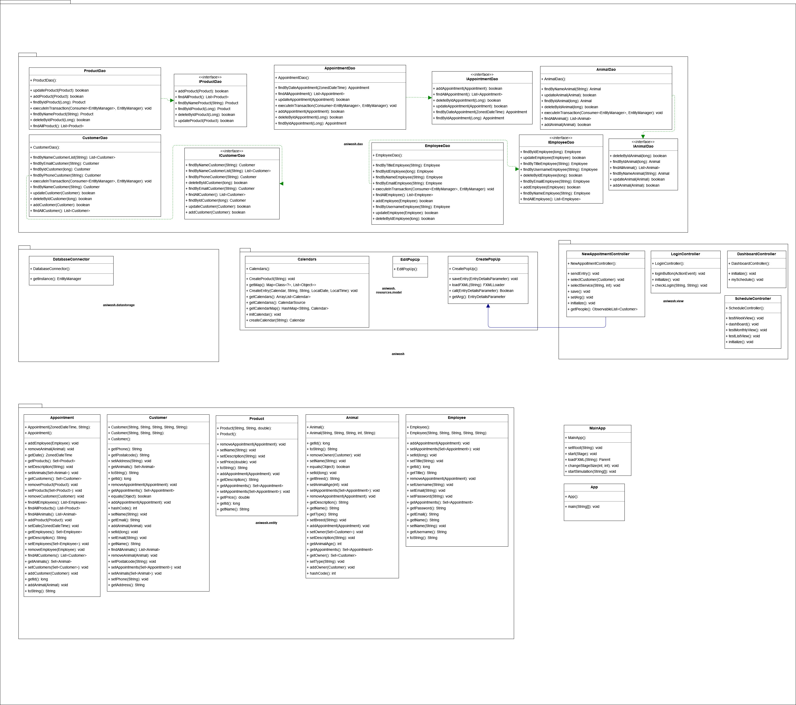
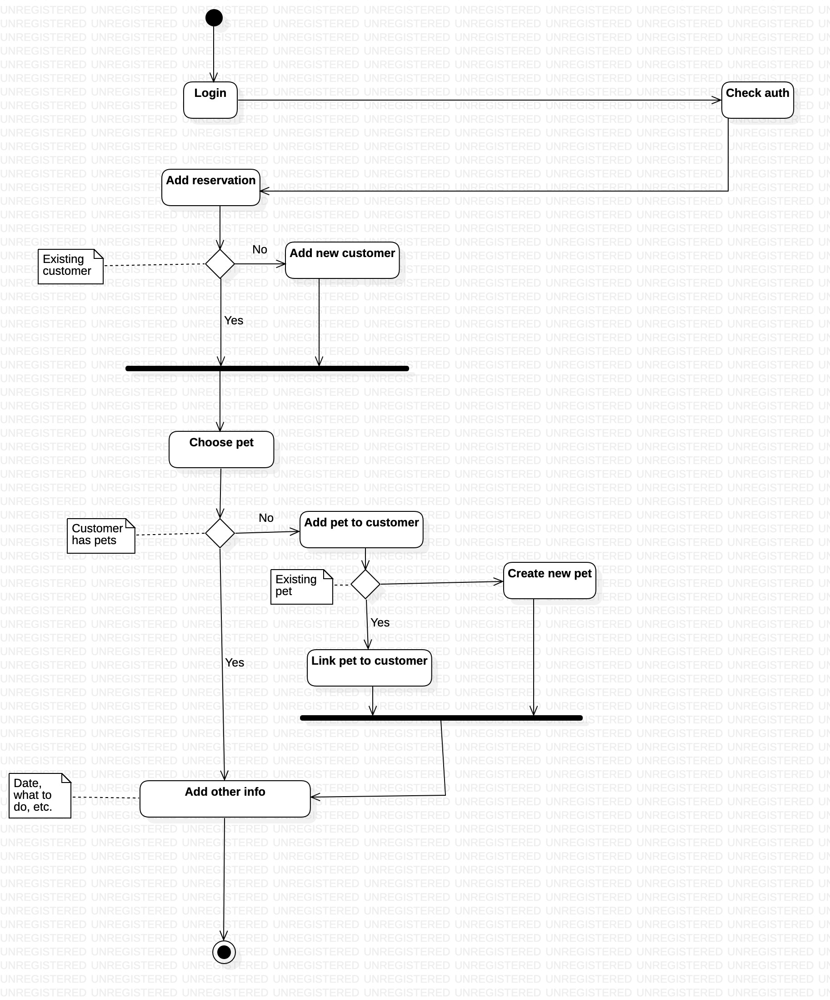
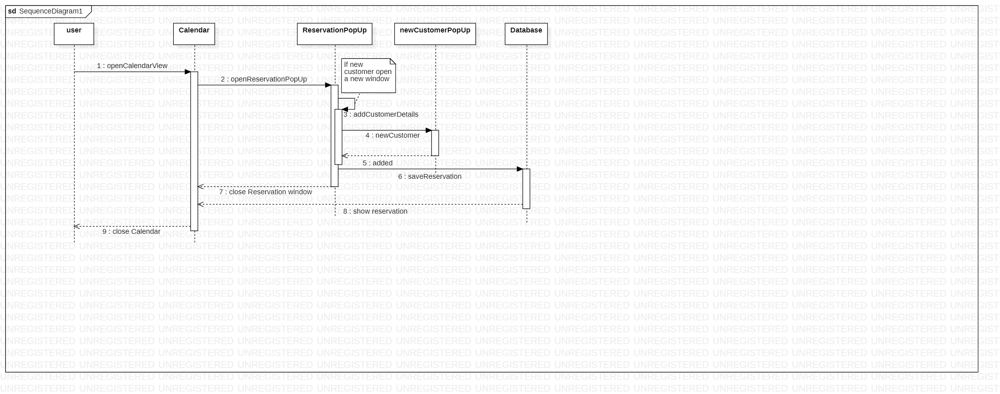

# AniWash  

## Table of contents
* [Features](#Features)
* [Installation](#Installation)
* [Future plans](#Future-plans)
* [Class overview](#Class-overview)
* * [Class diagram](#Class-diagram)
* [Use case overview](#Use-case) 
* * [Use case diagram](#Use-case-diagram)
* [Package diagram](#Package-diagram)
* [Activity diagram](#Activity-diagram)
* [Sequence diagram](#sequence-diagram)
* 

## Features

Aniwash is a software for customer management and pet care scheduling. 

In the current version, the software has two employee types: the employer and the employee.
The employee has the ability to create customers, create pets and assign them to customers, create new products and services, and create new appointments.

The employer has the same abilities as the employee, but also has the ability to create new employees and edit the information of the employees.

There is a login page where the user can enter their username and password. If the user is not registered, the employer can create a new employee.

The software has a database where all the information is stored. The database is created using MySQL and the connection is made using the MySQL Connector.

The software is written in Java and uses the JavaFX library for the GUI.
## Installation
To run the software, you need to have Java 8 or higher installed on your computer. You also need to have MySQL installed on your computer. 
TODO: Add instructions for rest of installation.
### MySQL
To install MySQL, you can follow the instructions on the [MySQL website](https://dev.mysql.com/doc/mysql-installation-excerpt/5.7/en/).
### Java
To install Java, you can follow the instructions on the [Java website](https://www.java.com/en/download/help/download_options.xml).
## Future plans
* Add a page where the employer can see the employees.
* Add a customer page where the customer can see their pets and appointments.
* Add a pet page where the customer can see their pet's information and appointments.
* Add a page where the customer can see their invoices.
## Use case diagram:

## Class diagram:

## Package diagram:

## Activity diagram:

## Sequence diagram:

