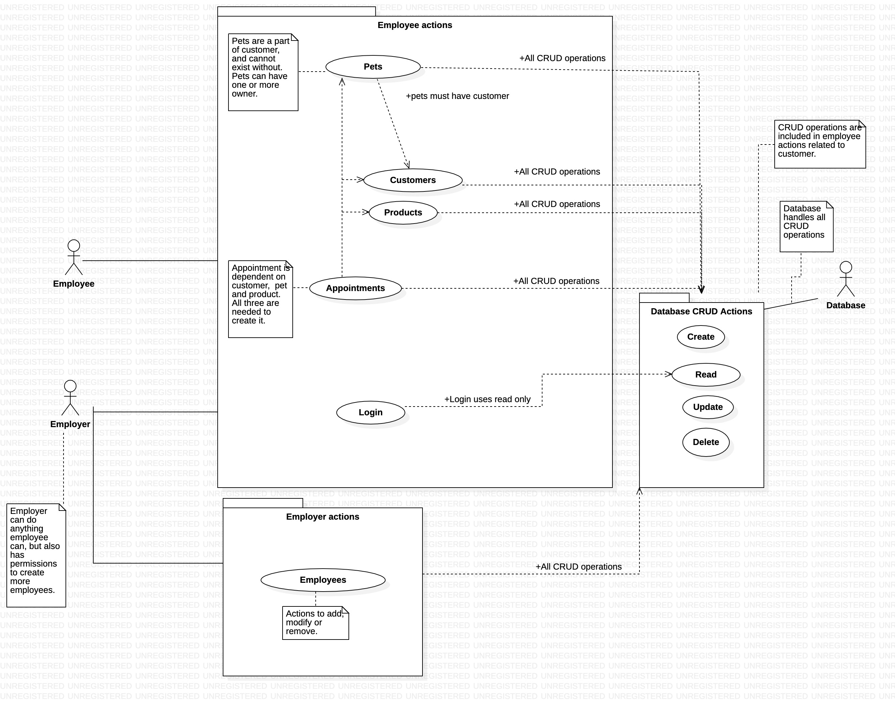

# AniWash  

## Table of contents
* [Authors](#authors)
* [Introduction](#introduction)
* [Installation](#installation)
* [Future plans](#future-plans)
* [Class overview](#class-overview)
* * [Class diagram](#class-diagram)
* [Use case overview](#use-case-overview) 
* * [Use case diagram](#use-case-diagram)
* [Package diagram](#package-diagram)
* [Activity diagram](#activity-diagram)
* [Sequence diagram](#sequence-diagram)
* [Sequence diagram explanation](#sequence-diagram-explanation)

## Introduction

Aniwash is a software for customer management and pet care scheduling. 

In the current version, the software has two employee types: the employer and the employee.
The employee has the ability to create customers, create pets and assign them to customers, create new products and services, and create new appointments.

The employer has the same abilities as the employee, but also has the ability to create new employees and edit the information of the employees.

There is a login page where the user can enter their username and password. If the user is not registered, the employer can create a new employee.

The software has a database where all the information is stored. The database is created using MySQL and the connection is made using the MySQL Connector.

The software is written in Java and uses the JavaFX library for the GUI.

## Installation
To run the software, you need to have Java 8 or higher installed on your computer. You also need to have MySQL installed on your computer. 
TODO: Add instructions for rest of installation.
### MySQL
To install MySQL, you can follow the instructions on the [MySQL website](https://dev.mysql.com/doc/mysql-installation-excerpt/5.7/en/).
### Java
To install Java, you can follow the instructions on the [Java website](https://www.java.com/en/download/help/download_options.xml).
## Future plans
* Add a page where the employer can see the employees.
* Add a customer page where the customer can see their pets and appointments.
* Add a pet page where the customer can see their pet's information and appointments.
* Add a page where the customer can see their invoices.

## Class overview
### Class diagram:

### Entity classes

Product, Appointment, Animal, Employee and Customer are entity classes stored in the database.
The purpose of product class is to show the manifestation of different products in the program, for example, Animal washing. The product class contains the most essential things about the product, such as price. Users can add new products.

Customer class is used to store customer information, so that it is easy to link the customer to the appointment. Employees can add new customers.

Animal class is for customers' animals, the purpose of this class is to preserve the essential information about the animal. The animal is selected from the customer when making an appointment. The employee can create a new animal that is immediately linked to the customer.

Employee class is a class for users of the system. Only a confirmed user can use the program, this is confirmed by logging in.

Appointment class is used to store appointment information. The appointment class contains all the information from the other entity classes. This is linked to the system's calendar by the user, from which the user can edit or delete it.

### DAO classes

ProductDao, AppointmentDao, AnimalDao, CustomerDao, EmployeeDao are classes for database management.
The purpose of the classes is to manage complex database functions, all Dao classes fetch the database instance from the DatabaseController class.

### Controllers

DatabaseController is a class used to create a database connection, the class uses Hibernate's EntityManager and passes it on.

NewAppointmentController is a controller used to create new appointments in the appointment view.

EditPopUp class is used to edit appointments.

DashboardController is a class used for user control in the dashboard view. 

ScheduleController is a class used to control and navigate the calendar view.

LoginController is a class used for user login.

Calendars class contains the information of the appointments and products in the calendar, this is where the information is fetched from the database where it is then transferred to the user's view.

## Use case overview
### Use case diagram:

### Actors

Employee:
The employee actor is the main user of the application and is most in contact with customers. Employee can create new customers, pets, products and appointments. Employees are authenticated by login username and password.

Employer:
The employer actor has the same actions as an employee, but also can add or remove employees.

Database:
The database actor is responsible for accessing the database for CRUD operations. Database actor is responsible for backend access. Other actors use the actions to retrieve, store or edit information from the database. 

### Actions

Employee actions:
* Customers
* Pets
* Products
* Appointments
* *	All the above actions access all CRUD operations performed by Database actor.
* Login
* *	Only has access to read for login purposes.

Database CRUD actions:
* Create
* *	Inserts new data into the database.
* Read
* *	Retrieves data from the database.
* Update
* *	Updates data in the database.
* Delete
* *	Deletes data from the database.

Employer actions:
* Employees
* *	All CRUD operations

## Package diagram:

## Activity diagram:

## Sequence diagram:

### Sequence diagram explanation

The sequence diagram shows the process of creating a new appointment.

First the user opens up the calendar view, where the user presses the plus button, which opens up a popup window. 
The user selects the customer, or alternatively creates a new customer. 

The user saves the appointment when all the required information is selected, which then transfers the appointment to the database, where the calendar view fetches the new appointment. 
The popup window closes automatically when saving, after which the user can close the calendar view.
